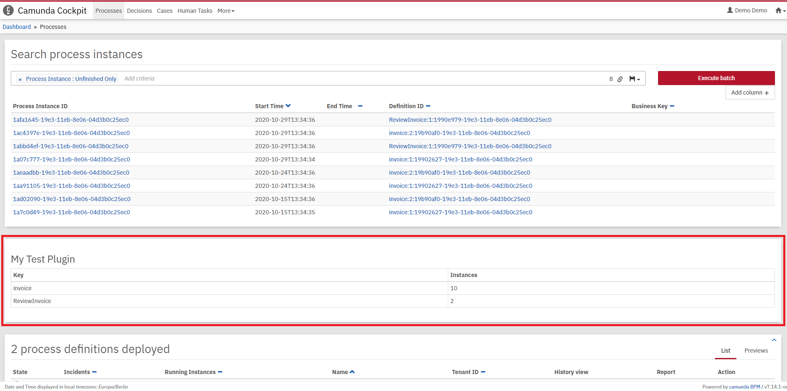

#set( $symbol_pound = '#' )
#set( $symbol_dollar = '$' )
#set( $symbol_escape = '\' )
${symbol_pound} ${camunda-plugin-name}
${camunda-plugin-description}

This project has been generated by the Maven archetype
[${archetype-artifactId}-${archetype-version}](http://docs.camunda.org/latest/guides/user-guide/#process-applications-maven-project-templates-archetypes).

${symbol_pound}${symbol_pound} Show me the important parts!

${symbol_pound}${symbol_pound} How does it work?

${symbol_pound}${symbol_pound} How to use it?
You can use `ant` to build and install the plugin to an existing Cockpit
inside an application server.
For that to work you need to copy the file `build.properties.example` to `build.properties`
and configure the path to your application server inside it.
Alternatively, you can also copy it to `${symbol_dollar}{user.home}/.camunda/build.properties`
to have a central configuration that works with all projects generated by the
[Camunda BPM Maven Archetypes](http://docs.camunda.org/latest/guides/user-guide/#process-applications-maven-project-templates-archetypes).

Once you installed the plugin it should appear in
[Camunda Cockpit](http://docs.camunda.org/latest/guides/user-guide/#cockpit).

${symbol_pound}${symbol_pound} More information
[How to install a Cockpit plugin](http://docs.camunda.org/latest/real-life/how-to/#cockpit-how-to-develop-a-cockpit-plugin-integration-into-cockpit)

[How to develop a Cockpit plugin](http://docs.camunda.org/latest/real-life/how-to/#cockpit-how-to-develop-a-cockpit-plugin)

Discover more Cockpit plugins in the
[Camunda Plugin Store](http://camunda.org/plugins/)

${symbol_pound}${symbol_pound} Environment Restrictions
Built and tested against Camunda BPM version ${camunda-version}.

${symbol_pound}${symbol_pound} Known Limitations

${symbol_pound}${symbol_pound} Improvements Backlog

${symbol_pound}${symbol_pound} License
[Apache License, Version 2.0](http://www.apache.org/licenses/LICENSE-2.0).

<!-- HTML snippet for index page
  <tr>
    <td></td>
    <td><a href="snippets/${artifactId}">${camunda-plugin-name}</a></td>
    <td>${camunda-plugin-description}</td>
  </tr>
-->