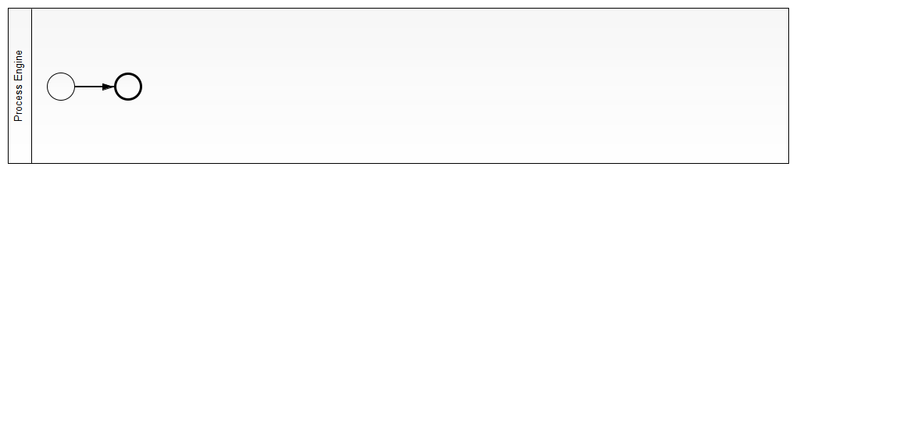

#set( $symbol_pound = '#' )
#set( $symbol_dollar = '$' )
#set( $symbol_escape = '\' )
${symbol_pound} ${project-name}
${project-description}

This project has been generated by the Maven archetype
[${archetype-artifactId}-${archetype-version}](http://docs.camunda.org/latest/guides/user-guide/#process-applications-maven-project-templates-archetypes).

${symbol_pound}${symbol_pound} Show me the important parts!

${symbol_pound}${symbol_pound} How does it work?

${symbol_pound}${symbol_pound} How to use it?
There is no web interface to access the application.
To get started refer to the `InMemoryH2Test`.

There is also an `ArquillianTest`, which by default connects to a
Camunda BPM platform running locally on a JBoss Wildfly application server.
You can download a Camunda BPM distribution for JBoss from the
[Camunda BPM download page](http://camunda.org/download/).

You can also use `ant` to build and deploy the example to an application server.
For that to work you need to copy the file `build.properties.example` to `build.properties`
and configure the path to your application server inside it.
Alternatively, you can also copy it to `${symbol_dollar}{user.home}/.camunda/build.properties`
to have a central configuration that works with all projects generated by the
[Camunda BPM Maven Archetypes](http://docs.camunda.org/latest/guides/user-guide/#process-applications-maven-project-templates-archetypes).

Once you deployed the application you can run it using
[Camunda Tasklist](http://docs.camunda.org/latest/guides/user-guide/#tasklist)
and inspect it using
[Camunda Cockpit](http://docs.camunda.org/latest/guides/user-guide/#cockpit).

${symbol_pound}${symbol_pound} Environment Restrictions
Built and tested against Camunda BPM version ${camunda-version}.

${symbol_pound}${symbol_pound} Known Limitations

${symbol_pound}${symbol_pound} Improvements Backlog

${symbol_pound}${symbol_pound} License
[Apache License, Version 2.0](http://www.apache.org/licenses/LICENSE-2.0).

<!-- HTML snippet for index page
  <tr>
    <td></td>
    <td><a href="snippets/${artifactId}">${project-name}</a></td>
    <td>${project-description}</td>
  </tr>
-->
<!-- Tweet
New @CamundaBPM example: ${project-name} - ${project-description} https://github.com/camunda/camunda-consulting/tree/master/snippets/${artifactId}
-->